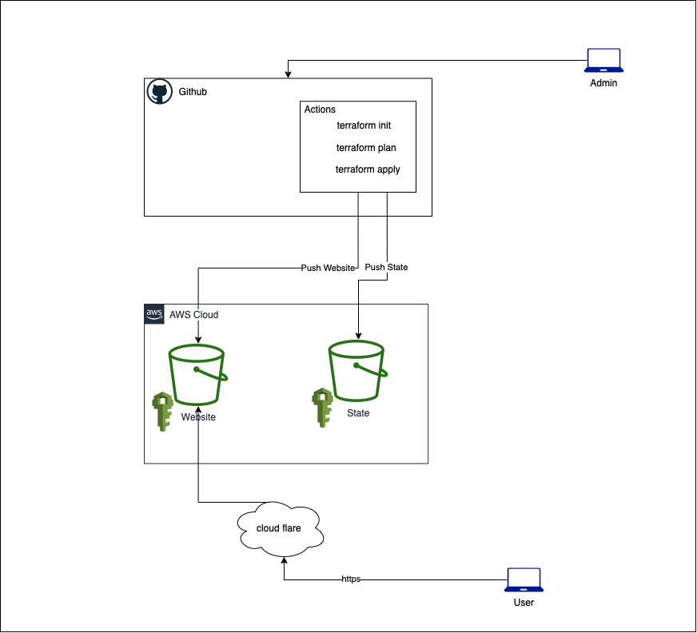

# Personal Link Page

I wanted a linktree like page but with my own domain and automated deployment with the cheapest method possible (s3
bucket). With S3 you also [pay per 1k requests](https://aws.amazon.com/s3/pricing/), with that we put cloudflare in
front to prevent ddos and paying for more than you anticipated.

## How does it work



We have github actions in the background listening for events pushed to the main branch, when you make a push it will
deploy the infrastructure.

## How to get started

### AWS

We need to create an IAM user, from there create an inline policy that allows github to make changes to your aws
account. We will go with the policy of least privilege. Here are the services we need access to and the changes we need
to make

| Service  | Permissions                                                                                                                                                          |
|----------|----------------------------------------------------------------------------------------------------------------------------------------------------------------------|
| S3       | PutObject<br/>Get*<br/>PutBucketWebsite<br/>PutBucketAcl<br/>PutBucketPolicy<br/>CreateBucket<br/>ListBucket<br/>PutBucketCORS<br/>PutBucketTagging<br/>DeleteObject |

#### How will it look in AWS?

*Please note your bucket name has to be the domain name you are using or else it won't work

```json
{
  "Version": "2012-10-17",
  "Statement": [
    {
      "Sid": "GitHub",
      "Effect": "Allow",
      "Action": [
        "s3:PutObject",
        "s3:PutBucketWebsite",
        "s3:PutBucketTagging",
        "s3:PutBucketPolicy",
        "s3:PutBucketCORS",
        "s3:PutBucketAcl",
        "s3:ListBucket",
        "s3:Get*",
        "s3:CreateBucket"
      ],
      "Resource": [
        "arn:aws:s3:::(Change me to your domain name)/*", <- This is your s3 website bucket
        "arn:aws:s3:::(change me to your domain name)" <- This is your s3 website bucket
      ]
    },
    {
      "Sid": "Backend Permissions",
      "Effect": "Allow",
      "Action": [
        "s3:ListBucket",
        "s3:GetObject",
        "s3:PutObject",
        "s3:DeleteObject"
      ],
      "Resource": [
        "arn:aws:s3:::(terraform state bucket)/(Change me to your domain name)/*", <- This is your terraform state bucket and website key
        "arn:aws:s3:::(terraform state bucket)" <- This is your terraform state bucket 
      ]
    }
  ]
}
```

What is the purpose of this policy?

We want to give github the least privileges possible. Github has access to read the objects for your website and put objects there, but not delete. To delete you go into your account and delete what you need to. (still working on a github action to tear down the project)

The backend has permission to delete only the state for your site, if you have other projects in your account github won't mess with them, unless you create an overly permissive policy.

Once you create the policy you need to create the access key on the security credentials tab of the IAM user. Save those
for a later step.

### Github

Clone the repository and there's a few values to change.

#### Everything in source folder

In the source folder is all the html, css and image files and such. Change this to however you like. In case you add
more files to the assets directory there might be a change in the terraform code you would need to make.

On line 70 - 84

```terraform
resource "aws_s3_object" "linktree_assets" {
  for_each     = fileset(path.module, "k/assets/*")
  source       = each.value
  bucket       = aws_s3_bucket.assets.bucket
  key          = trim(each.value, "k/")
  source_hash  = filemd5(each.value)
  content_type = lookup(
    {
      "png"         = "image/png",
      "ico"         = "image/x-icon"
      "webmanifest" = "text/plain"
    },
    split(".", each.value)[1],
    "text/plain")
}
```

This checks through each file in the assets directory and splits it after the "." to get the file extension, then it
sets the content type based off the file type. If you have a file type different from png, ico or webmanifest and the
content type isn't `text/plain` you will need to add it here.

Example

If you have a jpeg picture you added to the assets directory you would add `"jpeg" = "image/jpeg"` for it to properly
load

#### Environment Variables

This is managed on the github side of things. You will need to go to your repository -> Settings -> Security -> Secrets
-> Actions -> New Repository Secret

There are 6 secrets to set, the naming convention below

| Secret name              | Value                                                                  | 
|--------------------------|------------------------------------------------------------------------|
| AWS_ACCESS_KEY_ID        | Access Key copied earlier                                              |
| AWS_REGION               | Region to deploy to                                                    |
| AWS_S3_BUCKET            | This should be the name of your domain, otherwise there will be issues |
| AWS_SECRET_ACCESS_KEY    | Secret Access Key copied earlier                                       |
| TERRAFORM_BACKEND_BUCKET | This is the bucket we save the terraform live state                    |
| TERRAFORM_BACKEND_KEY    | This is the location in the bucket that holds the live state           |

### Cloudflare

#### Why cloudflare?

They have a free tier, and you pay for more advanced features, more often then not you don't need those enterprise features. Create an account in cloudflare, I don't recommend purchasing domains via cloudflare, I tried once and I didn't get a whoisguard to protect my personal info and never purchased another domain there. I could of missed a step and you're more than happy to try.

Otherwise once you create your account and you're in

- Add a site
  - Use your domain name
  - Select the plan you want (I use free)
  - At this point it will scan to ensure you have the correct DNS records. If you don't click continue and it will tell you what records to put in your registrar
- Update DNS Records
  - Go to DNS -> Add record
  - Change Type to CNAME
  - Change Name to subdomain of your domain
  - Change Target to the full bucket name


Example 

I own the "roserie.me" domain, For my links page I use the subdomain links.roserie.me so I would change type to CNAME, Name to links and Target to full bucket name

You can find the full bucket name going into the amazon console after you deployed the bucket.

- Go to S3
- Click into your bucket
- Properties Tab
- Scroll down to Static Website Hosting on the bottom of the page
- Your bucket name is the Bucket Website Endpoint minus the `http://`


### Notes

Ran into an issue that took way too long to figure out on my end. The [trim function](https://www.terraform.io/language/functions/trim) in terraform is used to structure the s3 bucket.
We put all the files in a directory and on S3 we remove that file name to structure the project. Only problem is in the finer details. On the documentation it mentions "trim removes the specified set of characters from the start and end of the given string.".

So what does this mean? Originally I had all the files in a directory called "source", trim will remove any characters (aka, 's','o','u','r','c','e') from the beginning and end of the file names, so .js files now became .j files. .ico files became .i, etc.  

## Thanks

Shoutout to [Sylwia Vargas](https://github.com/sylwiavargas/Tech-Writing-Linktree) for the base code